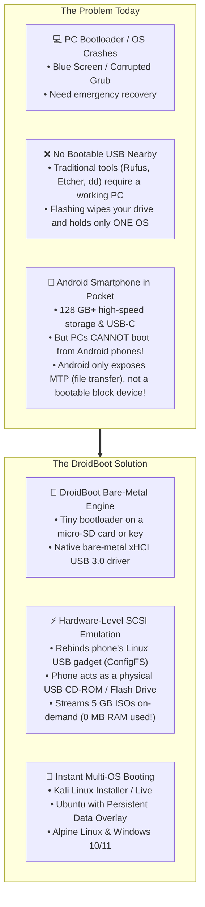
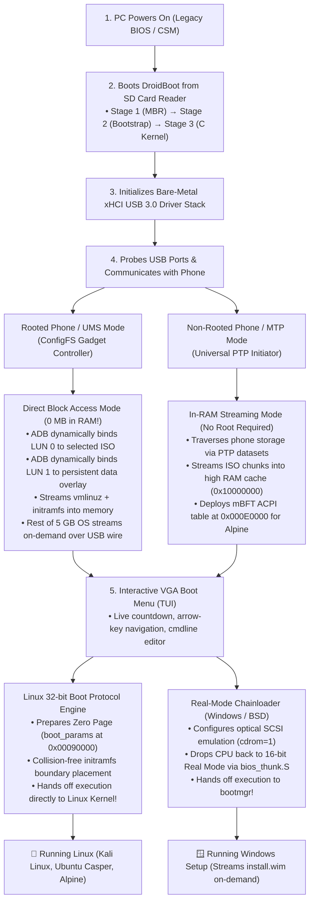
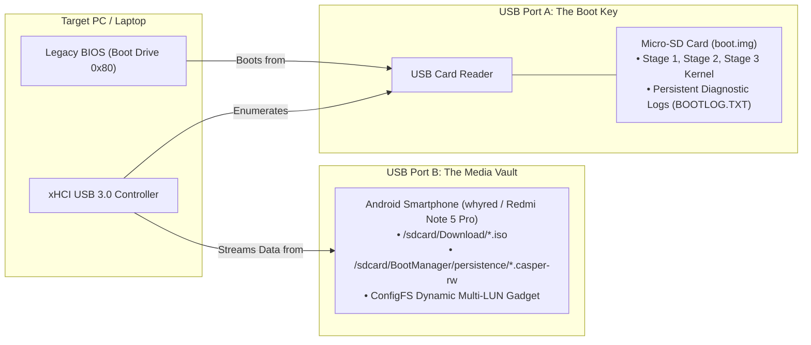

# DroidBoot Manager

[]()
[]()
[](LICENSE)
[]()

**DroidBoot** is an advanced, bare-metal x86 firmware bootloader that turns any **Android smartphone** (or USB storage device) into a universal, multi-OS boot medium for PCs and laptops.

You can download stock `.iso` files directly onto your phone (Kali Linux, Ubuntu, Windows, Alpine) and boot a dead or blank PC from your phone over a standard USB cable—**with 0 MB of the multi-gigabyte OS loaded into PC RAM**.

---

## 1. What Problem Does DroidBoot Solve?



### The Real-World Pain Points:
1. **The "Stranded with a Dead PC" Crisis**:
   When your PC crashes while traveling or at home, you typically need another working PC to download an ISO and write it to a dedicated USB drive using tools like Rufus or Etcher. With DroidBoot, your phone *is* the installer drive.
2. **The "Single-Purpose Flashed USB" Waste**:
   Standard bootable USB drives can only hold one flashed operating system at a time. If you want Ubuntu, Kali Linux, and Windows, you must carry three separate USB drives or constantly reformat.
3. **The Android MTP Barrier**:
   Your smartphone has 128 GB–256 GB+ of fast flash storage, but motherboards and BIOS firmware cannot boot from it because modern smartphones only expose the high-level **Media Transfer Protocol (MTP)** over USB, not low-level SCSI mass storage blocks.
4. **The "Out-of-RAM" Crash on Low-Spec Hardware**:
   Network booting (PXE) or RAM disk loaders require buffering the entire 4 GB–6 GB ISO into the PC's memory before booting, immediately crashing laptops with only 2 GB or 4 GB of RAM.

---

## 2. How Does DroidBoot Solve It? (The Core MVP)

The **Core MVP** of DroidBoot is **booting full operating systems directly from an Android phone (or USB storage)** with zero manual ISO burning, zero wasted RAM, and isolated persistent storage for your settings.



---

## 3. The Dual-Device Architecture

DroidBoot cleanly separates the **Boot Mechanism** from the **Media Storage Vault**:



### Multi-LUN Dynamic Pair Binding:
* **LUN 0 (Target OS ISO)**: When you select an OS in the boot menu, the phone binds `lun.0` to that specific ISO in under 1 second.
* **LUN 1 (Persistent User Overlay)**: Automatically binds that distribution's matching `.casper-rw` ext4 overlay disk so your files, browser tabs, and packages persist across reboots.

---

## 4. Supported Operating Systems

| Distribution / OS | Version Tested | Boot Strategy | Status |
| :--- | :--- | :--- | :--- |
| **Kali Linux** | `2026.2-installer-amd64.iso` | Direct Block Access (UMS) / Linux 32-bit Protocol | **VERIFIED (100% Pass)** |
| **Ubuntu Desktop** | `26.04.1-desktop-amd64.iso` | Direct Block Access (Casper Live + Persistence) | **VERIFIED (100% Pass)** |
| **Alpine Linux** | `alpine-standard-3.24.2-x86_64.iso` | In-RAM Staging (mBFT Table + phram) | **VERIFIED (100% Pass)** |
| **Arch Linux / Fedora** | Generic Live ISOs | Direct Block Access via Rock Ridge Parser | **SUPPORTED** |
| **Microsoft Windows** | Windows 10 / Windows 11 | Real-Mode VBR Chainloading (`cdrom=1` SCSI Optical) | **PLANNED (Phase 18)** |

---

## 5. Documentation Hub

All in-depth technical specifications and guides are located in the [`docs/`](docs/) directory:

| Document | Description |
| :--- | :--- |
| **[ARCHITECTURE.md](docs/ARCHITECTURE.md)** | Deep technical specifications, hardware driver stack, and Mermaid flowcharts. |
| **[DEVELOPER_GUIDE.md](docs/DEVELOPER_GUIDE.md)** | Contributor reference, bare-metal coding constraints, and diagnostic workflows. |
| **[ADDING_NEW_OS.md](docs/ADDING_NEW_OS.md)** | Step-by-step developer tutorial: How to add support for any new Linux distro or Windows. |
| **[MEMORY_MAP.md](docs/MEMORY_MAP.md)** | Physical memory layout (0x0000_0000 to 4 GiB) and collision-free initrd boundaries. |
| **[BOOT_IMAGE_FORMAT.md](docs/BOOT_IMAGE_FORMAT.md)** | Exact on-disk sector layout (LBA 0 to 2048+) and raw persistent log structures. |
| **[PROJECT_STATUS.md](docs/PROJECT_STATUS.md)** | Subsystem verification matrix and development roadmap (Phases 0 through 18). |
| **[TESTING.md](docs/TESTING.md)** | QEMU automated regression test harness, QMP hotplugging, and physical phone passthrough. |
| **[THIRD_PARTY.md](docs/THIRD_PARTY.md)** | Upstream open-source components and licensing tracking. |

---

## 6. Build & Test Instructions

### Prerequisites:
* **Assembler**: NASM (>= 2.15)
* **Compiler**: GCC with 32-bit multilib (`gcc -m32`)
* **Linker**: GNU `ld -m elf_i386`
* **Python**: Python 3.8+
* **Emulator**: QEMU (`qemu-system-x86_64`)

### Build:
```bash
# Build complete boot.img using cross-platform Python orchestrator:
python build.py

# Or using GNU Makefile:
make
```

### Run Tests:
```bash
# Run full 7-phase automated headless regression test suite:
python test.py

# Run specific distro test:
python test.py --suite kali        # Test Kali Linux 2026.2 Installer UMS Block Boot
python test.py --suite persistence # Test Dynamic Multi-Profile Persistence
python test.py --suite ram         # Test In-RAM Alpine Linux Boot

# Launch interactive desktop QEMU session:
python tools/run_qemu.py --mode kali

# Passthrough physical Android phone connected via USB to QEMU:
python tools/test_physical_phone_qemu.py
```

---

## 7. License

This project is licensed under the **MIT License** — see the [LICENSE](LICENSE) file for details. Third-party components retain their respective permissive open-source licenses as documented in [docs/THIRD_PARTY.md](docs/THIRD_PARTY.md).
