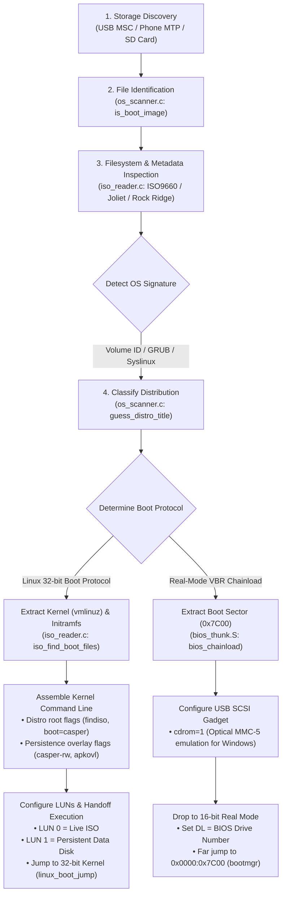
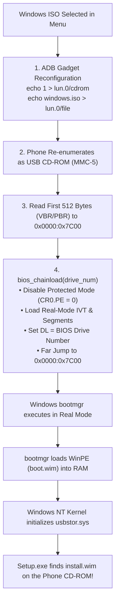

# DroidBoot: Adding Support for New Operating Systems

This guide provides a comprehensive, step-by-step walkthrough for developers who want to add support for a new Linux distribution, Windows, or other operating systems to the **DroidBoot Manager** codebase.

---

## 1. High-Level Architecture: How OS Support Works

Our bootloader does not require you to pre-burn ISOs or extract filesystem trees manually. Instead, it inspects live storage devices (USB Mass Storage drives, SD cards, and Android smartphones over ADB/MTP), dynamically detects operating system images, parses their boot configurations, and launches them.



---

## 2. Key Source Code Files

Every OS addition touches a predictable set of modular files in `src/stage3/`:

| Subsystem | File Path | Responsibility |
| :--- | :--- | :--- |
| **OS Scanner** | [src/stage3/image/os_scanner.c](file:///c:/Users/chaha/Projects/bootmanager/src/stage3/image/os_scanner.c) | Filename matching, Volume ID classification, and menu entry registration. |
| **ISO Reader** | [src/stage3/filesystem/iso_reader.c](file:///c:/Users/chaha/Projects/bootmanager/src/stage3/filesystem/iso_reader.c) | ISO9660 PVD parsing, kernel/initrd path heuristics, GRUB/Syslinux config parser. |
| **Boot Header** | [src/stage3/filesystem/iso_reader.h](file:///c:/Users/chaha/Projects/bootmanager/src/stage3/filesystem/iso_reader.h) | Data structures for discovered boot files and distribution flags. |
| **ADB Gadget** | [src/stage3/adb/adb.c](file:///c:/Users/chaha/Projects/bootmanager/src/stage3/adb/adb.c) | Phone USB gadget configuration (LUN 0 ISO binding, LUN 1 persistence, `cdrom` mode). |
| **Main Orchestrator** | [src/stage3/core/main.c](file:///c:/Users/chaha/Projects/bootmanager/src/stage3/core/main.c) | Kernel command-line assembly, persistence matching, safe memory layout, and kernel jump. |
| **Linux Boot Engine** | [src/stage3/linux/linux_boot.c](file:///c:/Users/chaha/Projects/bootmanager/src/stage3/linux/linux_boot.c) | Linux `boot_params` (Zero Page), E820 map transfer, video modes, and protected-mode jump. |
| **BIOS Thunk** | [src/stage3/bios/bios_thunk.S](file:///c:/Users/chaha/Projects/bootmanager/src/stage3/bios/bios_thunk.S) | Real-mode transition gateway for non-Linux OSes (Windows, FreeDOS, BSD). |

---

## 3. Tutorial: Adding a New Linux Distribution

Let's walk through adding support for a new Linux distribution (e.g., **Arch Linux Live** or **Fedora Workstation**).

### Step 3.1: Add Distro Title Classification
In [src/stage3/image/os_scanner.c](file:///c:/Users/chaha/Projects/bootmanager/src/stage3/image/os_scanner.c), locate `guess_distro_title()`:

```c
static void guess_distro_title(const char *filename, char *out_title, uint32_t max_len) {
    if (str_contains_nocase(filename, "ubuntu")) {
        copy_str(out_title, "Ubuntu Desktop Live (Casper)", max_len);
    } else if (str_contains_nocase(filename, "kali")) {
        copy_str(out_title, "Kali Linux Installer", max_len);
    } else if (str_contains_nocase(filename, "arch")) {
        // [NEW] Arch Linux classification
        copy_str(out_title, "Arch Linux Live (x86_64)", max_len);
    } else if (str_contains_nocase(filename, "fedora")) {
        // [NEW] Fedora Workstation classification
        copy_str(out_title, "Fedora Workstation Live", max_len);
    } ...
}
```

### Step 3.2: Add Kernel & Initramfs Path Heuristics
Linux distributions place their kernel and initramfs binaries in different standard directories on their ISOs:
* **Ubuntu**: `/casper/vmlinuz` and `/casper/initrd`
* **Kali / Debian**: `/install.amd/vmlinuz` and `/install.amd/initrd.gz`
* **Alpine**: `/boot/vmlinuz-lts` and `/boot/initramfs-lts`
* **Arch Linux**: `/arch/boot/x86_64/vmlinuz-linux` and `/arch/boot/x86_64/initramfs-linux.img`

In [src/stage3/filesystem/iso_reader.c](file:///c:/Users/chaha/Projects/bootmanager/src/stage3/filesystem/iso_reader.c), update `candidate_dirs` in `iso_find_boot_files()`:

```c
static const char *candidate_dirs[] = {
    "casper",
    "install.amd",
    "arch/boot/x86_64", // [NEW] Arch Linux kernel directory
    "images/pxeboot",    // [NEW] Fedora / RHEL pxeboot directory
    "boot",
    "isolinux",
    "syslinux",
    "live",
    NULL
};
```

### Step 3.3: Configure Distro-Specific Boot Parameters
In [src/stage3/core/main.c](file:///c:/Users/chaha/Projects/bootmanager/src/stage3/core/main.c), inside `boot_from_usb_msc()`:
When an ISO has an embedded GRUB configuration (`/boot/grub/grub.cfg`), our parser automatically extracts its command-line. However, if no configuration is present or fallback defaults are needed, assemble the distro-specific arguments:

```c
if (str_contains_nocase(iso_files.title, "arch") || str_contains_nocase(iso_files.volume_id, "ARCH")) {
    snprintf(cmdline, sizeof(cmdline),
             "archisobasedir=arch archisolabel=%s cow_spacesize=2G",
             iso_files.volume_id);
} else if (str_contains_nocase(iso_files.title, "fedora")) {
    snprintf(cmdline, sizeof(cmdline),
             "root=live:CDLABEL=%s rd.live.image quiet",
             iso_files.volume_id);
}
```

### Step 3.4: Configure Persistence Overlays
If the distribution supports persistent storage:
1. Define the persistence file format (e.g., ext4 disk image `.casper-rw`, `.img`, or tarball `.apkovl.tar.gz`).
2. In [src/stage3/adb/adb.c](file:///c:/Users/chaha/Projects/bootmanager/src/stage3/adb/adb.c), verify `adb_scan_persistence_profiles()` recognizes the profile extension.
3. In [src/stage3/core/main.c](file:///c:/Users/chaha/Projects/bootmanager/src/stage3/core/main.c), append the persistence flag (e.g. `persistent persistent-path=/BootManager/persistence/`).

---

## 4. Tutorial: Adding Windows Support (Chainloader)

Windows does not boot via the Linux 32-bit boot protocol. Instead, it uses Microsoft's **Boot Manager (`bootmgr`)** and requires **Optical SCSI (CD-ROM) emulation**.



### Step 4.1: Identify Windows Images in `os_scanner.c`
Check for Windows-specific indicators:
* Filenames: `windows*.iso`, `win10*.iso`, `win11*.iso`
* Volume IDs: `CCCOMA_...`, `ESD-ISO`, `IR5_...`
* Filesystem markers: Presence of `/bootmgr`, `/boot/bcd`, or `/sources/boot.wim`

```c
if (str_contains_nocase(name, "win") || str_contains_nocase(name, "windows")) {
    copy_str(entry->title, "Windows 10/11 Installer", sizeof(entry->title));
    entry->os_type = OS_TYPE_WINDOWS_INSTALLER;
}
```

### Step 4.2: Set Optical Drive Emulation (`cdrom=1`) in `adb.c`
Windows Setup requires the SCSI device to report as an optical disc (MMC-5 profile) rather than a direct-access disk:
```bash
echo 1 > "$M/lun.0/cdrom"
echo "$ISO" > "$M/lun.0/file"
echo 1 > "$M/lun.0/ro"
```

### Step 4.3: Real-Mode Chainload Execution
In [src/stage3/bios/bios_thunk.S](file:///c:/Users/chaha/Projects/bootmanager/src/stage3/bios/bios_thunk.S), implement `bios_chainload(uint8_t drive)`:
1. Load sector 0 of LUN 0 to physical address `0x0000:0x7C00`.
2. Stop the xHCI USB controller (`xhci_stop()`) to halt hardware DMA rings.
3. Drop to 16-bit real mode.
4. Pass the drive index in register `DL` (e.g. `0x80` or `0x81`).
5. Jump to `0x0000:0x7C00`.

---

## 5. Summary Checklist for Adding an OS

- [ ] **Identification**: Added filename and Volume ID patterns in `os_scanner.c`
- [ ] **Path Heuristics**: Added kernel and initramfs paths in `iso_reader.c`
- [ ] **Command Line**: Assembled required boot arguments in `main.c`
- [ ] **Persistence**: Supported overlay arguments (if applicable)
- [ ] **LUN Configuration**: Set `cdrom=0` (Linux disk) or `cdrom=1` (Windows optical) in `adb.c`
- [ ] **Boot Dispatch**: Routed to `linux_boot_jump` (Linux ABI) or `bios_chainload` (Real-mode VBR)
- [ ] **Testing**: Added automated regression case in `tools/qemu_test.py` and `test.py`
