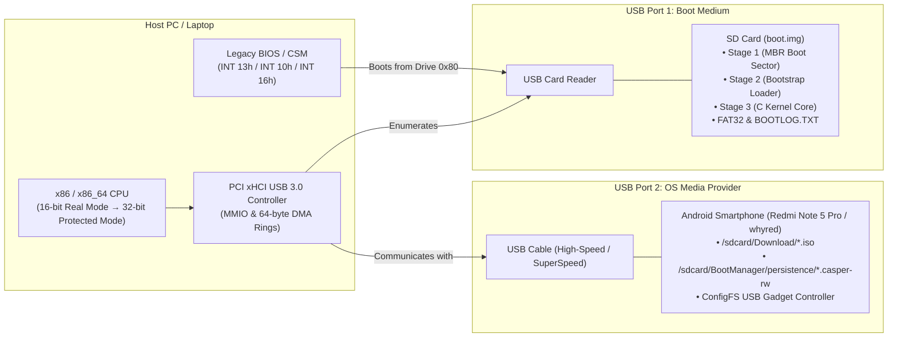
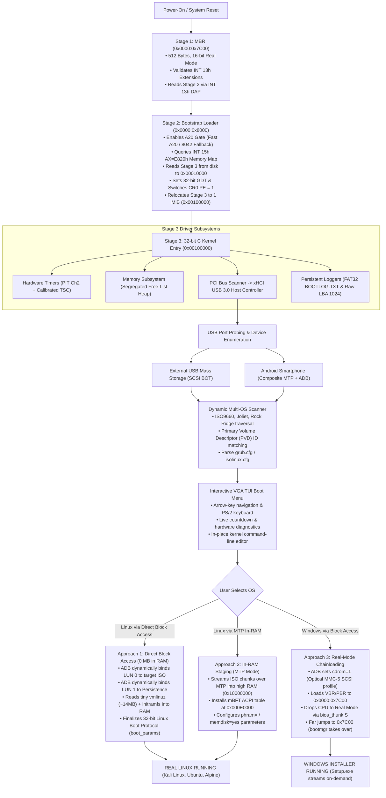
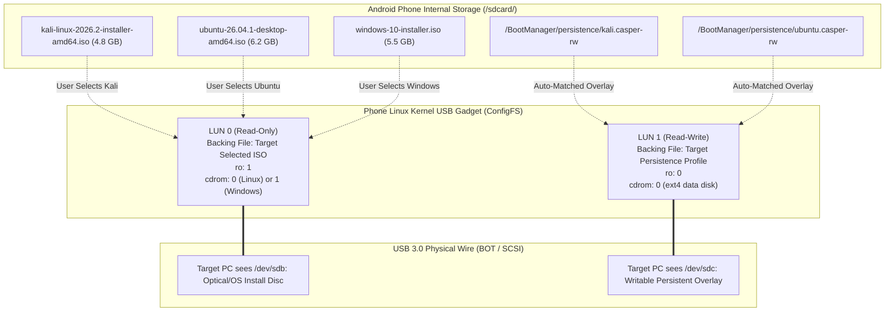

# DroidBoot Architecture & Technical Specifications

This document specifies the technical architecture of **DroidBoot Manager** (Android → PC Universal Bootloader).

---

## 1. System Overview

### 1.1 Physical Dual-Device Topology

The bootloader operates across two physically distinct USB devices connected to the host machine:

---

### 1.2 End-to-End Boot Execution Flow

---

### 1.3 Multi-LUN Dynamic Pair Binding Architecture

The bootloader solves the multi-ISO and writable persistence problem by implementing **Selection-Time Dynamic Binding**. Instead of exposing all ISOs simultaneously, the Android phone exposes **two active Logical Unit Numbers (LUNs)** configured dynamically at boot:

---

## 2. Subsystem Architectural Specifications

### 2.1 Stage 1 (MBR Boot Sector)
* **Source**: `src/stage1/stage1.asm`
* **Size**: Exactly 512 bytes.
* **CPU Mode**: 16-bit Real Mode.
* **Entry Point**: `0x0000:0x7C00`.
* **Execution Flow**:
  1. Initializes segment registers: `xor ax, ax; mov ds, ax; mov es, ax; mov ss, ax; mov sp, 0x7C00`.
  2. Preserves BIOS boot drive number in `DL`.
  3. Tests for BIOS INT 13h Extensions (`AH=0x41, BX=0x55AA`).
  4. Prepares Disk Address Packet (DAP) pointing to LBA 1 (Stage 2) with destination `0x0000:0x8000`.
  5. Executes `INT 13h, AH=0x42` (Extended Read).
  6. Verifies Stage 2 magic signature (`"STG2"` = `0x32475453`) at `0x8004`.
  7. Passes boot drive in `DL` and jumps to `0x0000:0x8000`.

### 2.2 Stage 2 (Bootstrap Loader)
* **Source**: `src/stage2/stage2.asm`
* **CPU Mode**: 16-bit Real Mode $\rightarrow$ 32-bit Flat Protected Mode.
* **Entry Point**: `0x0000:0x8000`.
* **Execution Flow**:
  1. Queries the system memory map using `INT 15h, AX=0xE820`. Stores up to 128 records at `0x0000:0x9000`.
  2. Enables the A20 Gate:
     * Attempts fast A20 via System Control Port `0x92`.
     * Falls back to Keyboard Controller (8042) command `0xDF` if required.
     * Validates A20 status by testing memory wrap-around at `0x107C00` vs `0x007C00`.
  3. Loads Stage 3:
     * Reads sector count and start LBA from the embedded header.
     * Uses `INT 13h, AH=0x42` to read Stage 3 in 64-sector chunks into temporary conventional memory at `0x0001:0x0000` (`0x10000`).
  4. Sets up the 32-bit Global Descriptor Table (GDT):
     * Entry 0: Null descriptor.
     * Entry 1 (`0x08`): 32-bit Code Segment (Base=0, Limit=4GB, Access=0x9A, Flags=0xCF).
     * Entry 2 (`0x10`): 32-bit Data Segment (Base=0, Limit=4GB, Access=0x92, Flags=0xCF).
  5. Sets `CR0.PE = 1` (Protected Mode Enable).
  6. Far jumps to protected mode selector: `jmp 0x08:pmode_entry`.
  7. In 32-bit protected mode, relocates Stage 3 from `0x10000` to `0x0010_0000` (1 MiB mark) via `rep movsd`.
  8. Jumps to Stage 3 entry point at `0x0010_0000`.

### 2.3 Stage 3 (C Runtime Core)
* **Source**: `src/stage3/core/entry.S`, `src/stage3/core/main.c`
* **Entry Point**: `stage3_entry` at `0x0010_0000`.
* **CPU Mode**: 32-bit Flat Protected Mode.
* **Execution Environment**:
  * Stack located at `0x0008_0000` - `0x0009_FFF0` (128 KiB).
  * Clears `.bss` section in memory.
  * Initializes COM1 UART (`0x3F8`) at 115200 baud 8N1 for real-time serial logging.
  * Initializes VGA text console (`0xB8000`) with color formatting.
  * Initializes persistent SD disk logging subsystem via real-mode BIOS thunking.
  * Parses E820 map and initializes segregated free-list heap allocator (24 MiB at `0x0080_0000`).
  * Scans PCI configuration space across 256 buses, 32 devices, 8 functions.
  * Initializes xHCI USB 3.0 controller and enters the operating system discovery loop.

### 2.4 xHCI USB 3.0 Host Controller Driver
* **Source**: `src/stage3/xhci/xhci.c`, `src/stage3/usb/usb.c`, `src/stage3/usb/usb_msc.c`
* **Heritage**: Derived from coreboot / libpayload (BSD 3-Clause).
* **Architecture**:
  * Maps Operational registers, resets controller (`USBCMD.HCRST`), configures maximum device slots.
  * 64-byte aligned DMA structures:
    * **DCBAA (Device Context Base Address Array)**: Holds physical pointers to Device Contexts.
    * **Command Ring**: Circular TRB ring for issuing controller commands.
    * **Event Ring with ERST**: Circular TRB ring receiving transfer events and completions.
    * **Scratchpad Buffer Array**: Allocates contiguous physical pages for internal controller state.
    * **Transfer Rings**: Dedicated per-endpoint rings handling control and bulk endpoint transfers.
  * Root port status detection, Enable Slot, Input Context assignment, and Address Device handshakes.

### 2.5 Android ADB Root Bridge & Dynamic UMS Switch
* **Source**: `src/stage3/adb/adb.c`, `adb.h`
* **Mechanism**:
  * Connects directly to Android's `adbd` over USB Bulk endpoints.
  * Implements freestanding ADB wire framing (`A_CNXN`, `A_AUTH`, `A_OPEN`, `A_OKAY`, `A_CLSE`, `A_WRTE`).
  * Authenticates using host RSA key (`ADBKEY.PUB`).
  * Executes root commands (`su -c`) to rebind the phone's ConfigFS gadget:
    * Binds `lun.0/file` to the selected `.iso` image (read-only).
    * Binds `lun.1/file` to the selected persistence profile `.casper-rw` (read-write).
    * Rebinds the gadget to the UDC; the phone instantly re-enumerates as a hardware USB Mass Storage drive.

### 2.6 Real-Mode BIOS Thunking Gateway
* **Source**: `src/stage3/bios/bios_thunk.S`, `bios_disk.c`
* **Mechanism**:
  * Low-overhead gateway transitioning the CPU from 32-bit Protected Mode back to 16-bit Real Mode and returning cleanly.
  * Mailbox buffer at `0x0000_7100` exchanges parameters (drive number, DAP address, command codes) and preserves 32-bit `ESP`.
  * Loads 16-bit GDT, clears `CR0.PE`, executes a far jump into Real Mode, loads the Real Mode IVT (`lidt`), executes the BIOS interrupt, and re-enters 32-bit Protected Mode.
  * Supports:
    * `bios_int13_call`: Extended disk read/write for persistent SD card logging.
    * `bios_int10_call`: VBE video mode query and switching.
    * `bios_int16_call`: Keyboard polling directly through BIOS services (supports built-in laptop keyboards without HID drivers).

### 2.7 Dual Persistent SD Card Logging Subsystem
* **Source**: `src/stage3/debug/disk_log.c`, `disk_log.h`
* **Architecture**:
  * 64 KiB circular in-memory buffer intercepting all `log_info` and `log_error` calls.
  * **FAT32 BOOTLOG.TXT**: Flushes directly to pre-allocated clusters on Partition 1 via ChaN FatFs / BIOS thunking.
  * **Raw LBA 1024 Backup**: Atomically writes a 512-byte header with magic `BOOTLOG!` and sectors 1024..1151. If the FAT32 filesystem is damaged, logs can always be extracted via `tools/read_bootlog.py`.

### 2.8 Universal Boot Config Parser & ISO Reader
* **Source**: `src/stage3/image/os_scanner.c`, `src/stage3/filesystem/iso_reader.c`, `src/stage3/filesystem/boot_cfg_parser.c`
* **Features**:
  * ISO 9660 reader with **Rock Ridge (SUSP/RRIP NM)** and **Joliet (UCS-2)** support.
  * Reads the Primary Volume Descriptor (PVD) to extract distribution Volume IDs (`Kali Linux amd64 1`, `Ubuntu Desktop`, `Alpine`).
  * Automatically inspects internal configuration files: `/boot/grub/grub.cfg`, `/isolinux/isolinux.cfg`, `/syslinux/syslinux.cfg`.
  * Extracts exact kernel paths (`vmlinuz`, `/casper/vmlinuz`, `/install.amd/vmlinuz`), initramfs paths (`initrd.img`, `/install.amd/initrd.gz`), and distro-native parameters.

### 2.9 Linux 32-bit Boot Protocol Engine
* **Source**: `src/stage3/linux/linux_boot.c`, `linux_boot.h`
* **Standard**: Official Linux x86 Boot Protocol (Protocol 2.00+).
* **Setup Steps**:
  1. Populates the 4096-byte `boot_params` structure at physical address `0x0009_0000`.
  2. Copies E820 system memory records so the kernel knows all usable RAM regions.
  3. Sets up standard 80x25 VGA text console parameters or VBE framebuffer info.
  4. Reads the setup header at offset `0x01F1` in `vmlinuz` to verify the magic signature `0x53726448` (`"HdrS"`).
  5. Computes the safe decompression boundary:
     $$\text{Safe Ceiling} = (\text{pref\_address} + \text{init\_size} + 2\text{MB}) \ \& \ \sim 2\text{MB}$$
     Loads the initramfs safely at or above this boundary (e.g., `0x0600_0000` / 96 MiB) to prevent the self-decompressor from corrupting the ramdisk.
  6. Copies the kernel command line string to `0x0009_A000`.
  7. Cleans up hardware state: flushes logs, stops xHCI (`xhci_stop()`), and silences PC speaker audio.
  8. Drops interrupts (`cli`), sets Linux 32-bit GDT (`__BOOT_CS = 0x10`, `__BOOT_DS = 0x18`), places `boot_params` pointer in `ESI = 0x0009_0000`, and jumps to `code32_start` (`0x0010_0000`).
