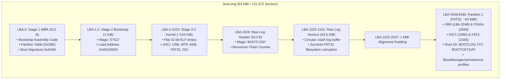

# Boot Image Format & Disk Sector Layout

This document defines the exact on-disk sector layout of `boot.img` generated automatically by [tools/mkimage.py](file:///c:/Users/chaha/Projects/bootmanager/tools/mkimage.py).

---

## 1. Visual Disk Structure



---

## 2. Disk Sector Layout Table

Standard sector size = 512 bytes (`0x200`). Total default size = 64 MiB (131,072 sectors).

```
Sector (LBA)        Byte Offset Range         Contents
---------------------------------------------------------------------------------
LBA 0               0x000000 - 0x0001FF       Stage 1 (MBR Boot Sector - 512 Bytes)
                    Offset 0x000 - 0x1AF:     Stage 1 Assembly Code
                    Offset 0x1B0 - 0x1B3:     Stage 2 Start LBA (dd 1)
                    Offset 0x1B4 - 0x1B5:     Stage 2 Sector Count (dw 2)
                    Offset 0x1BE - 0x1CD:     Partition 1 Table Entry (FAT32 LBA 0x0C)
                    Offset 0x1FE - 0x1FF:     Boot Signature (0x55, 0xAA)

LBA 1 .. 2          0x000200 - 0x0005FF       Stage 2 Bootstrap Loader (2 Sectors = 1 KiB)
                    Offset 0x000 - 0x003:     Jump opcode to Stage 2 entry
                    Offset 0x004 - 0x007:     Stage 2 Magic ("STG2" = 0x32475453)
                    Offset 0x008 - 0x00B:     Stage 3 Start LBA (LBA 3)
                    Offset 0x00C - 0x00F:     Stage 3 Sector Count (Calculated dynamically)
                    Offset 0x010 - 0x013:     Stage 3 Load Address (0x00100000)

LBA 3 .. (3+N-1)    0x000600 - ...            Stage 3 Main C Runtime Binary (Flat ELF32)
                    Linked at 0x00100000 (.text, .rodata, .data, BSS uninitialized)

LBA ... .. 1023     ...      - 0x07FFFF       Padding up to Raw Log Header (up to ~510 KiB for Stage 3)

LBA 1024            0x080000 - 0x0801FF       Raw Backup Log Header Sector (512 Bytes)
                    Offset 0x000 - 0x003:     Magic 1 ("BOOT" = 0x544F4F42)
                    Offset 0x004 - 0x007:     Magic 2 ("LOG!" = 0x21474F4C)
                    Offset 0x008 - 0x00B:     Log Length in Bytes (uint32)
                    Offset 0x00C - 0x00F:     Monotonic Flush Counter (uint32)
                    Offset 0x010 - 0x013:     BIOS Boot Drive (uint32)
                    Offset 0x014 - 0x017:     Flush Error Counter (uint32)

LBA 1025 .. 1151    0x080200 - 0x08FFFF       Raw Persistent Backup Log Area (127 Sectors = ~63.5 KiB)
                    Emergency fallback log readable via tools/read_bootlog.py even if FAT32 corrupts.

LBA 1152 .. 2047    0x090000 - 0x0FFFFF       Reserved Boot Alignment Padding (to 1 MiB boundary)

LBA 2048 .. END     0x100000 - END            Partition 1: FAT32 Boot Filesystem
                    LBA 2048:                 Volume Boot Record (VBR, Backup at LBA 2054)
                    LBA 2049:                 FSInfo Sector (Backup at LBA 2055)
                    LBA 2080:                 FAT 1 (256 Sectors)
                    LBA 2336:                 FAT 2 (256 Sectors)
                    LBA 2592:                 Data Area (Root Directory at Cluster 2)
                                              - BOOTLOG.TXT (Active boot log, Clusters 3..18)
                                              - BOOTCNT.DAT (Monotonic boot session counter, Cluster 19)
                                              - BOOT0001.LOG .. BOOT0010.LOG (10 rotating per-boot log archives, Clusters 20..179)
                                              - ADBKEY.PUB  (Optional dynamic host ADB public key, Cluster 180)
                                              - Dynamic multi-OS persistence profiles (/BootManager/persistence/)
```

---

## 3. Image Generation Constraints

1. **Deterministic Build**: Running `tools/mkimage.py` on unchanged inputs produces byte-for-byte identical output.
2. **Alignment & Padding**: Every stage is strictly padded to a 512-byte sector boundary.
3. **Partition Table Integrity**: Stage 1 code size is strictly bounded to $\le 432$ bytes, preserving the patch table (`0x1B0`), the 64-byte standard MBR partition table (`0x1BE`), and the boot signature `0xAA55`.
4. **Pre-Allocated Persistent Logs**: Both the FAT32 `BOOTLOG.TXT` cluster chain and the raw sector range (LBA 1024..1151) are formatted upfront to guarantee write targets without requiring complex runtime cluster allocation.
5. **Zero Manual Editing**: Manual hex editing of the boot image is strictly forbidden. All offsets and headers are patched automatically via [tools/mkimage.py](file:///c:/Users/chaha/Projects/bootmanager/tools/mkimage.py).
