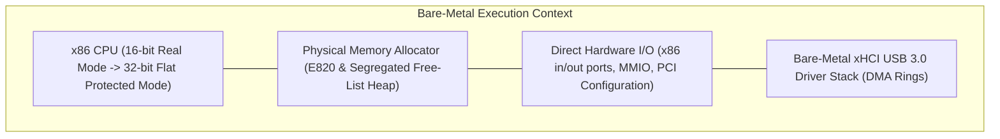
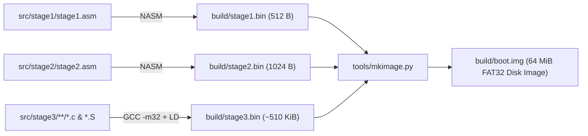
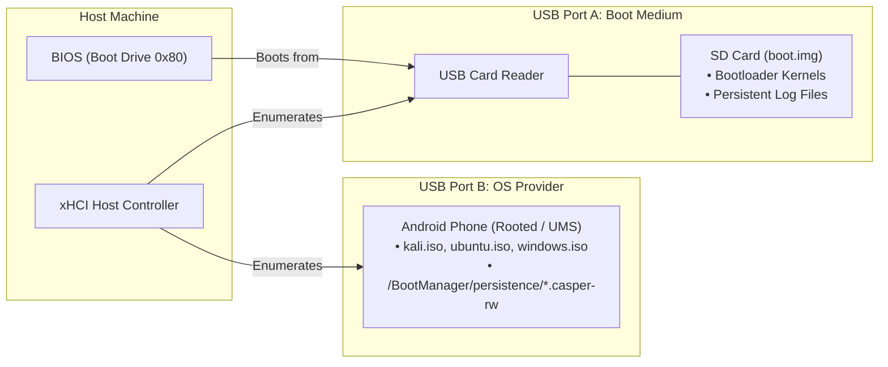
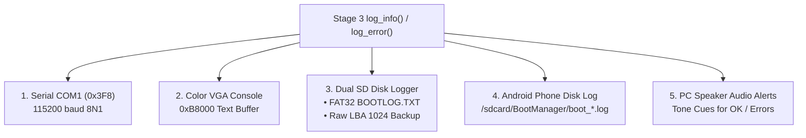

# DroidBoot Developer Guide & Contributor Reference

Welcome to the **DroidBoot Manager** developer guide. This document provides core architectural principles, development environment setup, coding guidelines, and debugging workflows for engineers contributing to this bare-metal codebase.

---

## 1. System Philosophy & Bare-Metal Runtime Rules

This project is a **bare-metal firmware operating system** running directly on physical x86 hardware without an underlying OS or standard C runtime (`libc`).



### Critical Rules of the Runtime:
1. **No Standard Libc**: Never `#include <stdio.h>` or `<stdlib.h>`. Only use freestanding compiler headers:
   * `<stdint.h>` (for exact-width integer types: `uint32_t`, `uint8_t`, etc.)
   * `<stddef.h>` (for `size_t` and `NULL`)
   * `<stdbool.h>` (for `bool`, `true`, `false`)
2. **Defensive Bounds Checking**: Buffer overflows cause immediate CPU triple faults or hardware hangs. Always use bounded string operations (`copy_str`, `snprintf`) with explicit destination capacities.
3. **Hardware Ring Integrity**: When managing xHCI USB controllers, **never shallow-copy active `usb_device_t` structures** (e.g. `devA = devB;`). Shallow copies duplicate ring pointers and corrupt transfer ring cycle bits, leading to endpoint stalls.
4. **Collision-Proof Memory Planning**: The kernel staging buffer (`0x02000000`) and the initramfs (`0x06000000`) must be dynamically placed above the kernel decompressor footprint:
   $$\text{Decompression Boundary} = (\text{pref\_address} + \text{init\_size} + 2\text{MB}) \ \& \ \sim 2\text{MB}$$

---

## 2. Development Environment Setup

### Required Toolchain:
* **Assembler**: NASM (>= 2.15)
* **Compiler**: GCC with 32-bit multilib (`gcc -m32`)
* **Linker**: GNU `ld -m elf_i386`
* **Python**: Python 3.8+
* **Emulator**: QEMU (`qemu-system-x86_64`)

### Linux / WSL (Ubuntu / Debian):
```bash
sudo apt update
sudo apt install build-essential gcc-multilib nasm qemu-system-x86 python3
```

### Windows (Native):
* Install NASM and add to `PATH`.
* Install MinGW-w64 or GCC with 32-bit target (`i686-w64-mingw32-gcc` or standard `gcc -m32`).
* Install QEMU for Windows and add to `PATH`.

---

## 3. Build System Architecture

The build process is managed by both a native GNU [Makefile](file:///c:/Users/chaha/Projects/bootmanager/Makefile) and a cross-platform Python orchestrator ([build.py](file:///c:/Users/chaha/Projects/bootmanager/build.py)):



### Standard Build Commands:
```bash
# Build complete boot.img:
python build.py

# Clean all artifacts:
python build.py --clean

# Build and immediately launch interactive QEMU session:
python build.py --run
```

---

## 4. Hardware Architecture: The Dual-Device Model



### Multi-LUN Dynamic Pair Binding:
The Android phone presents **two Logical Unit Numbers (LUNs)** across its single USB connection:
* **LUN 0**: The **Selected OS ISO** (Read-Only, 512-byte SCSI blocks or 2048-byte CD-ROM)
* **LUN 1**: The **Matching Writable Persistence Profile** (Read-Write ext4 overlay disk)

When you select a different distribution in the bootloader menu, [src/stage3/adb/adb.c](file:///c:/Users/chaha/Projects/bootmanager/src/stage3/adb/adb.c) executes a hot-swap command across ADB to re-bind LUN 0 and LUN 1 in under 1 second without disconnecting the physical USB cable.

---

## 5. Diagnostic & Logging Subsystems

Debugging bare-metal firmware requires real-time observability across multiple communication channels:



### 1. Reading Persistent Disk Logs from the Boot SD Card:
Even if a crash prevents the display from updating, persistent logs can be extracted from the SD card:
```bash
# Read the active boot log from the FAT32 filesystem or raw LBA 1024:
python tools/read_bootlog.py
```

### 2. Audio Error Codes (PC Speaker):
* **High-Low Fanfare**: Successful kernel handoff (jumping to Linux).
* **Two High Beeps**: Hardware USB Mass Storage drive connected.
* **Low Descending Tone**: Error encountered (check serial/log output).

---

## 6. Automated Testing Framework

All modifications must pass the unified regression test harness:

```bash
# Run full 7-phase automated regression suite:
python test.py

# Run specific suite:
python test.py --suite kali        # Test Kali Linux USB Block Boot
python test.py --suite persistence # Test Dynamic Casper Persistence
python test.py --suite ram         # Test In-RAM MTP Mode
```

### Testing against Physical Android Devices:
If you have a real Android smartphone connected via USB:
```bash
# Automatically passthrough your physical phone to a QEMU virtual machine:
python tools/test_physical_phone_qemu.py
```

---

## 7. Submitting Changes & Code Standards

1. **Keep Commits Focused**: Separate driver additions from UI or build harness changes.
2. **Synchronize Dependencies**: Header changes in `src/stage3/` must trigger recompilation of all affected modules (guaranteed by `STAGE3_HEADERS` in [Makefile](file:///c:/Users/chaha/Projects/bootmanager/Makefile)).
3. **Preserve Documentation**: When modifying physical addresses, update [docs/MEMORY_MAP.md](file:///c:/Users/chaha/Projects/bootmanager/docs/MEMORY_MAP.md). When changing sector offsets, update [docs/BOOT_IMAGE_FORMAT.md](file:///c:/Users/chaha/Projects/bootmanager/docs/BOOT_IMAGE_FORMAT.md).
