# Physical Memory Map & Ownership

This document defines the physical memory layout of the system during boot, specifying memory ownership, stage load addresses, hardware DMA structures, and buffer allocations.

All addresses are physical addresses below 4 GiB accessible in 32-bit flat protected mode.

---

## 1. Visual Memory Map

```mermaid
graph TD
    subgraph LowMem["Low Conventional Memory (0x0000_0000 - 0x0009_FFFF)"]
        IVT["0x0000_0000: Real-Mode IVT (1 KiB)<br>• Interrupt Vectors 0x00 - 0xFF"]
        BDA["0x0000_0400: BIOS Data Area (256 B)<br>• Timer ticks, equipment flags, COM ports"]
        SCRATCH["0x0000_0500: Early Scratch & Low Stack (26 KiB)"]
        THUNK["0x0000_7000: Real-Mode Thunk & Mailbox (bios_thunk.S)"]
        MBR["0x0000_7C00: Stage 1 MBR / Chainload VBR (512 B)"]
        DAP["0x0000_7E00: Disk Address Packet (512 B)"]
        TRAMP["0x0000_8000: Stage 2 Bootstrap / Linux Relocation Trampoline"]
        ZEROPG["0x0000_9000: Linux boot_params (Zero Page) + E820 Map (4 KiB)"]
        CMDLINE["0x0000_9A00: Linux Kernel Command Line (1.5 KiB)"]
        STAGE2STG["0x0001_0000: Stage 2 Staging Bounce Buffer (64 KiB)"]
        STACK["0x0008_0000: Stage 3 C Stack (128 KiB, grows down from 0x9FFF0)"]
    end

    subgraph ReservedHole["Hardware Reserved Space (0x000A_0000 - 0x000F_FFFF)"]
        VRAM["0x000A_0000: Video RAM & Color VGA Buffer (0x000B_8000)"]
        MBFT["0x000E_0000: mBFT ACPI Table (Alpine In-RAM ISO Discovery)"]
        BIOSROM["0x000F_0000: Motherboard BIOS ROM Services"]
    end

    subgraph HighMem["Extended Memory 1 MiB+ (Flat 32-bit Protected Mode)"]
        STG3["0x0010_0000: Stage 3 C Runtime (1 MiB mark)<br>• .text, .rodata, .data, .bss (reused by Linux kernel)"]
        XHCI["0x0040_0000: xHCI DMA Buffers (4 MiB)<br>• DCBAA, Command Ring, Event Ring, Scratchpads"]
        HEAP["0x0080_0000: Bootloader Dynamic Heap (24 MiB)<br>• Segregated free-list TLSF dynamic allocator"]
        KBUF["0x0200_0000: Linux Kernel Staging Buffer (32 MiB)"]
        INITRD["0x0600_0000: Initramfs Staging (96 MiB mark)<br>• Dynamically verified safe above kernel decompressor"]
        RAMISO["0x1000_0000: In-RAM ISO Cache (256 MiB+)<br>• Used when streaming over MTP without root"]
        FREE["0x2000_0000+: Available Physical RAM<br>• Mapped via E820 table to Linux kernel"]
    end

    LowMem --> ReservedHole --> HighMem
```



---

## 2. Physical Address Allocation Table

```
+-----------------------------------+ 0x0000_0000
| Real-Mode IVT (1024 B)            | Real-Mode Interrupt Vector Table
+-----------------------------------+ 0x0000_0400
| BIOS Data Area (256 B)            | BDA (timer ticks, equipment list)
+-----------------------------------+ 0x0000_0500
| Early Scratch / Low Stack (26 KB) | Stage 1 & 2 scratch memory
+-----------------------------------+ 0x0000_7000
| BIOS Thunk Code & Mailbox (512 B) | Real-Mode Thunk gateway (bios_thunk.S)
+-----------------------------------+ 0x0000_7C00
| Stage 1 MBR Boot Sector (512 B)   | Loaded by BIOS, executed at 0x7C00
+-----------------------------------+ 0x0000_7E00
| Disk Address Packet (DAP) (512 B) | INT 13h extended read structures
+-----------------------------------+ 0x0000_8000
| Stage 2 Bootstrap / Trampoline    | Real-mode setup; reused for Linux Trampoline
+-----------------------------------+ 0x0000_9000
| E820 Map / Linux boot_params (4K) | Up to 128 E820 records; Linux boot_params
+-----------------------------------+ 0x0000_9A00
| Linux Command Line (1.5 KiB)      | Formatted kernel cmdline string
+-----------------------------------+ 0x0001_0000
| Stage 2 Staging Buffer (64 KiB)   | Low-memory bounce buffer for Stage 3 load
+-----------------------------------+ 0x0008_0000
| Stage 3 C Stack (128 KiB)         | Grows downwards from 0x0009_FFF0
+-----------------------------------+ 0x000A_0000
| Video RAM, Option ROMs, BIOS ROM  | RESERVED HARDWARE REGION (VGA at 0xB8000)
+-----------------------------------+ 0x000E_0000
| mBFT ACPI Table (256 B)           | MEMDISK Boot Information Table for In-RAM ISO
+-----------------------------------+ 0x0010_0000 (1 MiB BOUNDARY)
| Stage 3 C Runtime Code & Data     | .text, .rodata, .data, .bss (reused by Linux kernel)
+-----------------------------------+ 0x0040_0000 (4 MiB)
| xHCI DMA Memory Region (4 MiB)    | DCBAA, Rings, Scratchpads, TRBs
+-----------------------------------+ 0x0080_0000 (8 MiB)
| Bootloader Heap (24 MiB)          | Dynamic memory allocator
+-----------------------------------+ 0x0200_0000 (32 MiB)
| Kernel Buffer (bzImage) & Initrd  | Staging buffer for kernel and safe initrd address
+-----------------------------------+ 0x0600_0000 (96 MiB)
| Dynamic Initramfs Safe Target     | Placed safely above decompressor footprint
+-----------------------------------+ 0x1000_0000 (256 MiB)
| In-RAM ISO Staging Buffer         | Holds streamed ISO when booting via MTP
+-----------------------------------+ 0x2000_0000 (512 MiB+)
| Available System RAM              | Free memory discovered via E820
+-----------------------------------+ 
| End of Physical RAM               | End of Usable RAM (from E820 map)
+-----------------------------------+
```

---

## 3. Dynamic Decompressor Collision Avoidance

Modern Linux kernels (`vmlinuz`) contain an embedded self-extractor (piggybacked gzip/xz/zstd payload). When the kernel starts, it decompresses itself into memory starting at `pref_address`. If the initramfs is loaded too close to `pref_address`, the decompressor will overwrite the ramdisk, resulting in a kernel panic (*"Kernel panic - not syncing: VFS: Unable to mount root fs"*).

Our bootloader dynamically inspects the kernel setup header (`0x01F1` in `vmlinuz`) and calculates the decompression ceiling:

$$\text{Decompression End} = \text{pref\_address} + \text{init\_size}$$
$$\text{Safe Initrd Boundary} = (\text{Decompression End} + 0x001FFFFF) \ \& \ \sim 0x001FFFFF$$

If the default `initrd_phys` (`0x0600_0000`) is below `Safe Initrd Boundary`, the bootloader automatically relocates the initramfs target safely above the boundary, ensuring 100% collision-free decompression across all distributions.

---

## 4. RAM Footprint Comparison by Boot Mode

| Metric | Approach 1: Direct Block Access (UMS/USB MSC) | Approach 2: In-RAM Staging (MTP Mode) |
| :--- | :--- | :--- |
| **Kernel & Initramfs in RAM** | ~35–100 MB at `0x0200_0000` & `0x0600_0000` | ~35–100 MB at `0x0200_0000` & `0x0600_0000` |
| **OS Filesystem Footprint in RAM** | **0 MB** (Streamed on-demand over USB wire) | Full ISO cached at `0x1000_0000` (Type 2 E820 Reserved) |
| **Total PC RAM Consumed** | **~35–100 MB** | **Full ISO Size + ~100 MB** (e.g. 5–7 GB) |
| **Boot Startup Time** | **Instant** (3–5 seconds) | **Staged** (Requires streaming full ISO first) |
