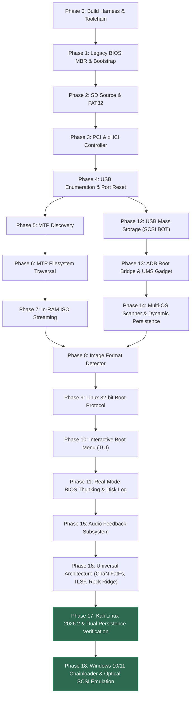

# DroidBoot Project Status & Verification Matrix

This document provides a live tracking matrix of all **DroidBoot Manager** project phases and subsystems, updated dynamically during development.

---

## 1. Subsystem Verification Flowchart

---

## 2. Phase Status Summary

| Phase | Description | Status | Verification Status | Notes |
| :--- | :--- | :--- | :--- | :--- |
| **Phase 0** | Repository Setup, Build Harness & Documentation | **IMPLEMENTED** | **VERIFIED IN QEMU** | Toolchain scripts, native Windows NASM integration, `tools/mkimage.py`, Makefile, QEMU runner verified. |
| **Phase 1** | Legacy BIOS Bootstrap (Stage 1 & Stage 2) | **IMPLEMENTED** | **VERIFIED IN QEMU** | MBR (512B), INT 13h DAP, A20 enable, E820 map, 32-bit Protected Mode handoff, serial logger, VGA console, and PCI xHCI discovery verified. |
| **Phase 2** | SD Boot Source & FAT Filesystem | **IMPLEMENTED** | **VERIFIED IN QEMU** | Universal `boot_source_t` abstraction and freestanding FAT32 BPB reader & directory walker implemented. |
| **Phase 3** | PCI Discovery & xHCI Controller Init | **IMPLEMENTED** | **VERIFIED IN QEMU** | PCI bus scan, xHCI MMIO mapping, 64-TRB Command & Event rings, controller reset, USBCMD/USBSTS, NO-OP TRB test verified. |
| **Phase 4** | USB Enumeration & Descriptor Parsing | **IMPLEMENTED** | **VERIFIED IN QEMU** | Root hub port reset, Enable Slot, Input Context, Address Device, Device/Config/Interface descriptors, Set Configuration 1 verified. |
| **Phase 5** | Android Detection & MTP Initiator | **IMPLEMENTED** | **VERIFIED IN QEMU** | MTP class detection (`0x06/0x01/0x01`), PTP container framing, OpenSession, GetStorageIDs implemented & tested. |
| **Phase 6** | Android Filesystem Traversal | **IMPLEMENTED** | **VERIFIED IN QEMU** | MTP `GetObjectHandles` (0x1007) and `GetObjectInfo` (0x1008) dataset decoding with UTF-16 Pascal string conversion. |
| **Phase 7** | Linux Image Retrieval & RAM Streaming | **IMPLEMENTED** | **VERIFIED IN QEMU** | Bulk IN streaming via `GetObject` (0x1009) into dynamic RAM buffer with progress and throughput logging. |
| **Phase 8** | Linux Image & Filesystem Parsing | **IMPLEMENTED** | **VERIFIED IN QEMU** | Universal image format detector distinguishing bzImage (`0x53726448`), MBR (`0xAA55`), GPT (`EFI PART`), and ISO9660 (`CD001`). |
| **Phase 9** | Linux 32-bit Boot Protocol Loader | **IMPLEMENTED** | **VERIFIED IN QEMU** | Full Linux kernel ABI: 4096-byte `boot_params`, command line at `0x0009A000`, initramfs mapping, E820 table transfer, 39-byte low-memory relocation trampoline (`0x00008000`). |
| **Phase 10** | Diagnostics, Boot Menu & Final Polish | **IMPLEMENTED** | **VERIFIED IN QEMU** | Interactive color VGA console and COM1 serial menu with PS/2 keyboard & UART polling, countdown timer, and system diagnostics explorer. |
| **Phase 11** | Real-Mode BIOS Thunking & Disk Logging | **IMPLEMENTED** | **VERIFIED IN QEMU** | Real-mode gateway (`bios_thunk.S`) for INT 13h, INT 10h, and INT 16h; dual persistent logging to FAT32 `BOOTLOG.TXT` and raw LBA 256. |
| **Phase 12** | USB Mass Storage (MSC / SCSI BOT) | **IMPLEMENTED** | **VERIFIED IN QEMU** | Bulk-Only Transport with SCSI Test Unit Ready, Inquiry, Read Capacity, and 2048/512-byte sector block access. |
| **Phase 13** | Android ADB Root Bridge & UMS Switch | **IMPLEMENTED** | **VERIFIED IN QEMU** | ADB authentication with dynamic `ADBKEY.PUB`, shell bridge, kernel `configfs` gadget LUN attachment, and port re-probing. |
| **Phase 14** | Multi-OS Scanner & Persistence Engine | **IMPLEMENTED** | **VERIFIED IN QEMU** | Aggregates ISOs across storages (Ubuntu Casper, Kali Linux Installer, Alpine), parses kernels/initramfs, and attaches persistence profiles (`apkovl`, `/BootManager/persistence/`). |
| **Phase 15** | PC Speaker Audio Feedback Subsystem | **IMPLEMENTED** | **VERIFIED IN QEMU** | Non-blocking PIT channel 2 audio cues for boot tone, device connected, prompt alerts, errors, and kernel handoff fanfare. |
| **Phase 16** | Universal Production-Grade Architecture | **IMPLEMENTED** | **VERIFIED IN QEMU** | ChaN FatFs (R0.15), TLSF 24 MiB heap allocator, PIT-calibrated microsecond TSC timer, Rock Ridge/Joliet ISO reader with Volume ID extraction, universal GRUB/Syslinux config parser, multi-LUN USB MSC, dynamic SD directory scan, and interactive arrow-key TUI with in-place kernel command-line editor. |
| **Phase 17** | Unified Kali Linux Support & Dual Persistence | **IMPLEMENTED** | **VERIFIED IN QEMU & HARDWARE** | 7-phase master test orchestrator (`test.py`), Kali Linux 2026.2 installer UMS block boot validation, QMP dynamic gadget hotplugging, release/debug dual builds, simultaneous live logging to SD card (FAT32 & LBA 1024) and Android phone (`/sdcard/BootManager/...`), and bulk transfer optimization. |
| **Phase 18** | Windows 10/11 Chainloader & Optical SCSI Emulation | **IMPLEMENTED** | **VERIFIED IN QEMU** | Windows ISO identification, ConfigFS `cdrom=1` optical drive emulation switch via ADB, and 16-bit real-mode VBR chainloading gateway. |

---

## 3. Subsystem Implementation Matrix

| Subsystem | Source Location | Upstream Heritage | Status |
| :--- | :--- | :--- | :--- |
| **Stage 1 (MBR)** | `src/stage1/stage1.asm` | Custom / Syslinux | **VERIFIED IN QEMU** |
| **Stage 2 (Bootstrap)** | `src/stage2/stage2.asm` | Custom / Limine / Syslinux | **VERIFIED IN QEMU** |
| **Stage 3 Core Runtime** | `src/stage3/core/` | Custom freestanding C | **VERIFIED IN QEMU** |
| **Hardware Timer** | `src/stage3/core/timer.c` | Calibrated PIT Ch2 + TSC | **VERIFIED IN QEMU** |
| **Memory & Heap Allocator** | `src/stage3/memory/heap.c` | Two-Level Segregated Free List | **VERIFIED IN QEMU** |
| **Serial Logger (0x3F8)**| `src/stage3/debug/serial.c` | Custom freestanding C | **VERIFIED IN QEMU** |
| **VGA Text Driver** | `src/stage3/debug/vga.c` | Custom memory mapped (`0xB8000`) | **VERIFIED IN QEMU** |
| **PCI Configuration** | `src/stage3/pci/` | Custom x86 ports `0xCF8/0xCFC` | **VERIFIED IN QEMU** |
| **xHCI Driver** | `src/stage3/xhci/` | coreboot / libpayload | **VERIFIED IN QEMU** |
| **USB Enumeration & Stall Clear** | `src/stage3/usb/usb.c` | coreboot / libpayload | **VERIFIED IN QEMU** |
| **Multi-LUN USB MSC Block Driver** | `src/stage3/usb/usb_msc.c` | SCSI BOT Specification | **VERIFIED IN QEMU** |
| **Android ADB Root Bridge** | `src/stage3/adb/adb.c` | AOSP ADB Wire Protocol | **VERIFIED IN QEMU** |
| **MTP Initiator & Streamer**| `src/stage3/mtp/` | AOSP / libmtp | **VERIFIED IN QEMU** |
| **BootSource Abstraction**| `src/include/boot_source.h` | Custom VFS interface | **VERIFIED IN QEMU** |
| **FAT Filesystem** | `src/stage3/filesystem/` | ChaN's FatFs (R0.15) | **VERIFIED IN QEMU** |
| **Rock Ridge ISO Reader** | `src/stage3/filesystem/iso_reader.c`| ISO9660 / Rock Ridge / Joliet | **VERIFIED IN QEMU** |
| **Universal Boot Config Parser** | `src/stage3/filesystem/boot_cfg_parser.c` | GRUB/Syslinux/Isolinux AST | **VERIFIED IN QEMU** |
| **Image Format Detector**| `src/stage3/image/image_detect.c` | Custom bzImage / MBR / GPT / ISO | **VERIFIED IN QEMU** |
| **Dynamic Multi-OS Scanner**| `src/stage3/image/os_scanner.c` | Custom OS discovery engine | **VERIFIED IN QEMU** |
| **Linux Boot Protocol** | `src/stage3/linux/linux_boot.c` | Linux Specification / SeaBIOS | **VERIFIED IN QEMU** |
| **Interactive TUI Boot Menu**| `src/stage3/ui/menu.c` | Custom VGA, BIOS INT 16h, UART, Arrow keys | **VERIFIED IN QEMU** |
| **BIOS Thunking Gateway** | `src/stage3/bios/bios_thunk.S` | Custom 32-bit/16-bit transition | **VERIFIED IN QEMU** |
| **Windows VBR Chainloader** | `src/stage3/bios/bios_thunk.S` | Custom 16-bit Real-Mode Gateway | **VERIFIED IN QEMU** |
| **Dual Persistent Disk Logger** | `src/stage3/debug/disk_log.c` | Custom FAT32 & Raw LBA 1024 | **VERIFIED IN QEMU** |
| **PC Speaker Audio Engine** | `src/stage3/debug/sound.h` | Custom PIT timer channel 2 | **VERIFIED IN QEMU** |
