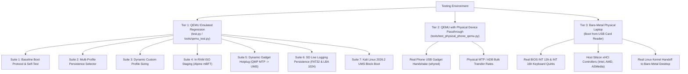

# DroidBoot Test Strategy & Verification Guide

This document outlines the testing workflow for **DroidBoot Manager** across emulator (QEMU) and physical target hardware.

---

## 1. Testing Hierarchy & Verification Architecture



---

## 2. What QEMU Proves vs. Does Not Prove

### What QEMU Proves:
* Stage 1 BIOS MBR loading, INT 13h DAP extended sector reads, register preservation (`DL`).
* Stage 2 real-to-protected mode transition, A20 gate activation, E820 memory map parsing.
* Stage 3 C runtime initialization, 32-bit GDT, stack setup, serial UART (`COM1 0x3F8`) logging.
* Real-mode BIOS thunking (`bios_thunk.S`) for INT 13h, INT 10h, and INT 16h keyboard polling.
* Dual persistent disk logging to FAT32 `BOOTLOG.TXT` and raw LBA 1024 backup sectors.
* PCI configuration space scanning and PCI device discovery.
* xHCI controller initialization, command/event ring mechanics, and USB enumeration.
* USB Mass Storage (MSC) SCSI Bulk-Only Transport reading 2048-byte CD sectors.
* ISO9660 PVD Volume ID parsing, Joliet, and Rock Ridge directory walking.
* Linux 32-bit boot protocol header validation, collision-free `boot_params` placement, and trampoline kernel jump.

### What QEMU Does NOT Prove:
* Physical laptop BIOS quirkiness (e.g., BIOS mapping SD cards as floppy `0x00` vs hard disk `0x80`).
* Real xHCI silicon quirks (timing, context sizes, and scratchpad limits across Intel, AMD, ASMedia, and Renesas controllers).
* Real-world smartphone USB gadget state machines (lock screen permissions, MTP container timeouts, USB mode selection dialogs).
* Physical USB cable noise and disconnect/reconnect recovery.

---

## 3. Unified Test Runner (`python test.py`)

The repository provides a single master test orchestrator at the root of the project:

### 3.1 Complete Automated Regression Suite (Default)
```bash
python test.py                 # Runs complete automated regression suite (all 7 suites)
python test.py --debug         # Runs complete regression suite against Debug build image
```
* Runs all 7 headless automated test suites in sequence.
* Emulates xHCI, USB mass storage, dynamic gadget switching, and SD card live block writeback in pure software.
* Tests all boot phases: Stage 1 MBR → Stage 2 A20 → Stage 3 Protected Mode → E820 RAM → PCI scan → xHCI initialization → USB enumeration → TUI menu → Linux kernel handoff → SD card persistence.

### 3.2 Running Individual Test Suites
```bash
python test.py --suite baseline     # Phase 1-10 bootstrap, memory map, PCI, xHCI, TUI menu, self-test
python test.py --suite persistence  # Multi-profile persistence selector and clean disposable session
python test.py --suite sizing       # Dynamic custom persistence overlay capacity sizing (2GB, 4GB, 8GB, 16GB)
python test.py --suite ram          # In-RAM ISO streaming and phram parameter kernel handoff
python test.py --suite gadget       # Dynamic phone mode-switch simulation (MTP -> UMS via QMP hotplug)
python test.py --suite sdlog        # Live SD card writeback persistence (FAT32 BOOTLOG.TXT, BOOT0001.LOG, LBA 1024)
python test.py --suite kali         # Kali Linux 2026.2 installer UMS block boot & GTK initrd resolution
```

### 3.3 Interactive Visual Debugging
```bash
python test.py --interactive
```
* Launches QEMU with a graphical window and live COM1 serial UART output connected to your terminal.
* Allows manual arrow-key navigation, in-place kernel command-line editing (`'e'`), and manual OS selection.

### 3.4 Testing Debug vs. Release Images
* **Release (`build/boot.img`)**: Maximum speed, clean console, persistent disk logging disabled by design (`IS_DEBUG_BUILD = 0`).
* **Debug (`build/boot-debug.img`)**: Deep hardware diagnostics, verbose xHCI/USB packet logging, and simultaneous live logging to SD card (`BOOTLOG.TXT`, `BOOT0001.LOG`, LBA 1024) and Android phone (`/sdcard/BootManager/...`).
```bash
python test.py                 # Tests Release image (build/boot.img)
python test.py --debug         # Tests Debug image (build/boot-debug.img)
```

---

## 4. Persistent Log Extraction (`tools/read_bootlog.py`)

Even if the screen is black or the target machine freezes, logs are written simultaneously to both the boot SD card / USB drive and the Android phone:

```bash
# Read the active boot log from the FAT32 filesystem or raw LBA 1024:
python tools/read_bootlog.py

# Extract logs from a raw disk image:
python tools/read_bootlog.py --image build/test_sd_persist.img
```

---

## 5. Testing with a Physical Android Device

To test using your actual physical Android phone connected via USB without needing a separate test PC:

```bash
# Automatically finds your phone on the host USB bus and passes it directly to QEMU:
python tools/test_physical_phone_qemu.py
```
This tests:
1. True xHCI hardware enumeration against real Android USB descriptors.
2. Real-world MTP container streaming performance over physical USB wire.
3. ADB authentication handshake against your physical smartphone.
